```mermaid
flowchart TB
    subgraph current["CardCrawler.csproj"]
        MAIN["<b>📦&nbsp;CardCrawler.csproj</b><br/><small>net10.0-windows7.0</small>"]
        click MAIN "#cardcrawlercardcrawlercsproj"
    end
    subgraph downstream["Dependencies (1"]
    end
    MAIN --> P2

```

# Projects and dependencies analysis

This document provides a comprehensive overview of the projects and their dependencies in the context of upgrading to .NETCoreApp,Version=v10.0.

## Table of Contents

- [Executive Summary](#executive-Summary)
  - [Highlevel Metrics](#highlevel-metrics)
  - [Projects Compatibility](#projects-compatibility)
  - [Package Compatibility](#package-compatibility)
  - [API Compatibility](#api-compatibility)
- [Aggregate NuGet packages details](#aggregate-nuget-packages-details)
- [Top API Migration Challenges](#top-api-migration-challenges)
  - [Technologies and Features](#technologies-and-features)
  - [Most Frequent API Issues](#most-frequent-api-issues)
- [Projects Relationship Graph](#projects-relationship-graph)
- [Project Details](#project-details)

  - [CardCrawler.Browser\CardCrawler.Browser.csproj](#cardcrawlerbrowsercardcrawlerbrowsercsproj)
  - [CardCrawler.CardMarket\CardCrawler.Cardmarket.csproj](#cardcrawlercardmarketcardcrawlercardmarketcsproj)
  - [CardCrawler\CardCrawler.csproj](#cardcrawlercardcrawlercsproj)

## Executive Summary

### Highlevel Metrics

| Metric | Count | Status |
| :--- | :---: | :--- |
| Total Projects | 3 | 0 require upgrade |
| Total NuGet Packages | 2 | All compatible |
| Total Code Files | 5 |  |
| Total Code Files with Incidents | 0 |  |
| Total Lines of Code | 615 |  |
| Total Number of Issues | 0 |  |
| Estimated LOC to modify | 0+ | at least 0,0% of codebase |

### Projects Compatibility

| Project | Target Framework | Difficulty | Package Issues | API Issues | Est. LOC Impact | Description |
| :--- | :---: | :---: | :---: | :---: | :---: | :--- |
| [CardCrawler.Browser\CardCrawler.Browser.csproj](#cardcrawlerbrowsercardcrawlerbrowsercsproj) | net10.0-windows7.0 | ✅ None | 0 | 0 |  | ClassLibrary, Sdk Style = True |
| [CardCrawler.CardMarket\CardCrawler.Cardmarket.csproj](#cardcrawlercardmarketcardcrawlercardmarketcsproj) | net10.0-windows7.0 | ✅ None | 0 | 0 |  | ClassLibrary, Sdk Style = True |
| [CardCrawler\CardCrawler.csproj](#cardcrawlercardcrawlercsproj) | net10.0-windows7.0 | ✅ None | 0 | 0 |  | DotNetCoreApp, Sdk Style = True |

### Package Compatibility

| Status | Count | Percentage |
| :--- | :---: | :---: |
| ✅ Compatible | 2 | 100,0% |
| ⚠️ Incompatible | 0 | 0,0% |
| 🔄 Upgrade Recommended | 0 | 0,0% |
| ***Total NuGet Packages*** | ***2*** | ***100%*** |

### API Compatibility

| Category | Count | Impact |
| :--- | :---: | :--- |
| 🔴 Binary Incompatible | 0 | High - Require code changes |
| 🟡 Source Incompatible | 0 | Medium - Needs re-compilation and potential conflicting API error fixing |
| 🔵 Behavioral change | 0 | Low - Behavioral changes that may require testing at runtime |
| ✅ Compatible | 0 |  |
| ***Total APIs Analyzed*** | ***0*** |  |

## Aggregate NuGet packages details

| Package | Current Version | Suggested Version | Projects | Description |
| :--- | :---: | :---: | :--- | :--- |
| HtmlAgilityPack | 1.12.4 |  | [CardCrawler.Cardmarket.csproj](#cardcrawlercardmarketcardcrawlercardmarketcsproj) | ✅Compatible |
| PuppeteerSharp | 20.2.5 |  | [CardCrawler.Browser.csproj](#cardcrawlerbrowsercardcrawlerbrowsercsproj) | ✅Compatible |

## Top API Migration Challenges

### Technologies and Features

| Technology | Issues | Percentage | Migration Path |
| :--- | :---: | :---: | :--- |

### Most Frequent API Issues

| API | Count | Percentage | Category |
| :--- | :---: | :---: | :--- |

## Projects Relationship Graph

Legend:
📦 SDK-style project
⚙️ Classic project

```mermaid
flowchart LR
    P1["<b>📦&nbsp;CardCrawler.csproj</b><br/><small>net10.0-windows7.0</small>"]
    P3["<b>📦&nbsp;CardCrawler.Browser.csproj</b><br/><small>net10.0-windows7.0</small>"]
    P1 --> P2
    P2 --> P3
    click P1 "#cardcrawlercardcrawlercsproj"
    click P3 "#cardcrawlerbrowsercardcrawlerbrowsercsproj"

```

## Project Details

### CardCrawler.Browser\CardCrawler.Browser.csproj

#### Project Info

- **Current Target Framework:** net10.0-windows7.0✅
- **SDK-style**: True
- **Project Kind:** ClassLibrary
- **Dependencies**: 0
- **Dependants**: 1
- **Number of Files**: 1
- **Lines of Code**: 103
- **Estimated LOC to modify**: 0+ (at least 0,0% of the project)

#### Dependency Graph

Legend:
📦 SDK-style project
⚙️ Classic project

### API Compatibility

| Category | Count | Impact |
| :--- | :---: | :--- |
| 🔴 Binary Incompatible | 0 | High - Require code changes |
| 🟡 Source Incompatible | 0 | Medium - Needs re-compilation and potential conflicting API error fixing |
| 🔵 Behavioral change | 0 | Low - Behavioral changes that may require testing at runtime |
| ✅ Compatible | 0 |  |
| ***Total APIs Analyzed*** | ***0*** |  |

### CardCrawler\CardCrawler.csproj

#### Project Info

- **Current Target Framework:** net10.0-windows7.0✅
- **SDK-style**: True
- **Project Kind:** DotNetCoreApp
- **Dependencies**: 1
- **Dependants**: 0
- **Number of Files**: 1
- **Lines of Code**: 299
- **Estimated LOC to modify**: 0+ (at least 0,0% of the project)

#### Dependency Graph

Legend:
📦 SDK-style project
⚙️ Classic project

### API Compatibility

| Category | Count | Impact |
| :--- | :---: | :--- |
| 🔴 Binary Incompatible | 0 | High - Require code changes |
| 🟡 Source Incompatible | 0 | Medium - Needs re-compilation and potential conflicting API error fixing |
| 🔵 Behavioral change | 0 | Low - Behavioral changes that may require testing at runtime |
| ✅ Compatible | 0 |  |
| ***Total APIs Analyzed*** | ***0*** |  |

